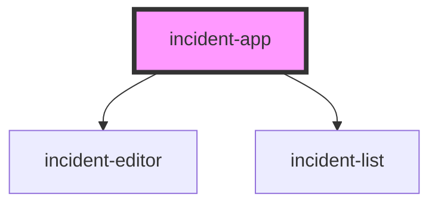

# incident-app

<!-- Auto Generated Below -->

## Properties

| Property   | Attribute   | Description | Type     | Default |
| ---------- | ----------- | ----------- | -------- | ------- |
| `basePath` | `base-path` |             | `string` | `''`    |

## Dependencies

### Depends on

- [incident-editor](../incident-editor)
- [incident-list](../incident-list)

### Graph

----------------------------------------------

*Built with [StencilJS](https://stenciljs.com/)*
