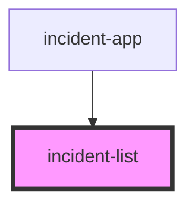

# incident-list

<!-- Auto Generated Below -->

## Properties

| Property  | Attribute  | Description | Type     | Default  |
| --------- | ---------- | ----------- | -------- | -------- |
| `apiBase` | `api-base` |             | `string` | `'/api'` |

## Events

| Event               | Description | Type                  |
| ------------------- | ----------- | --------------------- |
| `entry-clicked`     |             | `CustomEvent<string>` |
| `new-entry-clicked` |             | `CustomEvent<void>`   |

## Dependencies

### Used by

 - [incident-app](../incident-app)

### Graph

----------------------------------------------

*Built with [StencilJS](https://stenciljs.com/)*
